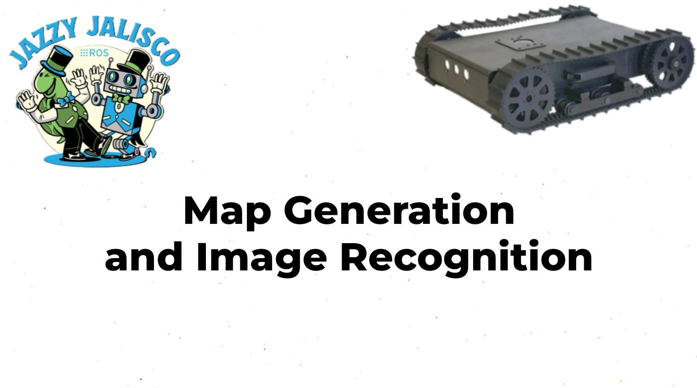
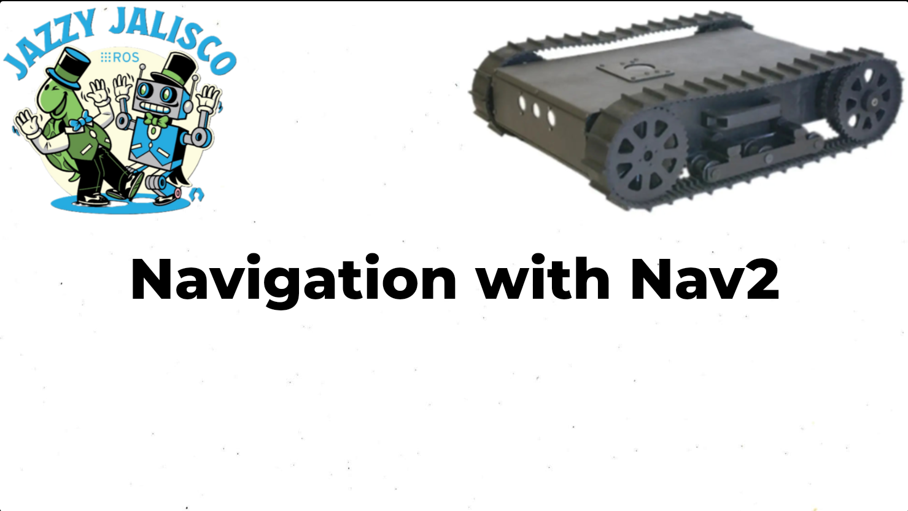
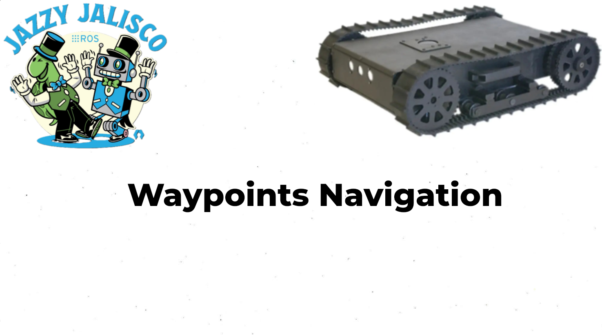

# tracked_robot-
# Tracked Mobile Robot Control and Navigation

**Author:** Mykyta Semeniuk
**Field:** Mechanical Engineer
**LinkedIn:** [Mykyta Semeniuk](https://www.linkedin.com/in/mykytasemeniuk/)

## Project Overview

This repository contains the code and documentation for my Master's thesis project, which focused on the development, control, and navigation of a tracked mobile robot. The project involved implementing various robotics concepts to enable autonomous operation.

## Hardware Components
A single-board computer, Raspberry Pi, is used for high-level processing, and an Arduino controller is utilized for real-time control tasks. The sensing system for environment perception includes 2D LiDAR and a camera for image recognition. The connection diagram is illustrated below. 

### 1. Map Generation using `slam_toolbox`

This video demonstrates the robot's capability to generate a 2D map of an unknown environment using the `slam_toolbox` package in ROS 2. The robot navigates an indoor environment, mapping the space and identifying objects. The robot's movement and image recognition are displayed in real-time, showcasing its ability to perceive and understand its surroundings. However, the  average FPS value is low.

### 2. Navigation using Nav2

This video showcases the robot's autonomous navigation capabilities utilizing the Nav2 stack in ROS.

### 3. Waypoints Following

This video demonstrates the robot's ability to follow a predefined sequence of waypoints.

### 4. Image Recognition with YOLO

The robot is also equipped with image recognition capabilities using a YOLO (You Only Look Once) model. This allows the robot to detect and classify objects in its environment.

